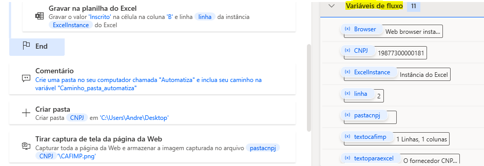

# Criar e editar instâncias e variáveis no Power Automate

Os robôs criados no Power Automate funcionam melhor quando criamos instâncias e variáveis. Elas servem para armazenar endereços de sites, caminhos de arquivos e credenciais de acesso a sistemas. Além disso, protegem informações confidenciais, como logins e senhas de acesso, para que não fiquem expostas no texto do código do robô.

<!-- more -->

Mudar informações de instâncias e variáveis permite o robô executar os mesmos fluxos com outros sites, arquivos e usuários. No exemplo da imagem acima, temos variáveis criadas para:

- a página web acessada pelo navegador crhome: `Browser`;
- o nome de uma pasta no computador local que foi criada: `pastacnpj`;
- a planilha que foi aberta durante a execução do fluxo pelo robô: `ExcellInstance`;
- o valor dentro da planilha `CNPJ`;
- textos que foram capturados da web e foram inseridos na planilha: `textocafimp` e `textoparaexcel`.

Esse exemplo é parte de um robô que realiza consultas ao Cadastro de Fornecedores Impedidos de licitar com a administração (CAFIMP), e pode ser acessado [nessa página do nosso repositório](https://automatiza-mg.github.io/automatizacoes/robos/consulta_situacao_cadastral_cagec/).

Se um usuário deseja utilizar esse mesmo robô, precisará checar, pelo menos, o caminho no computador em que será criada a pasta `pastacnpj` e informá-lo quando da edição dessa variável. Também é uma boa prática editar os nomes das variáveis `Browser` e `ExcelInstance` para que sejam memorizadas e aplicadas ao caso concreto mais facilmente. Uma sugestão poderia ser `sitecafimp` e `planilhacnpj`, por exemplo.

E o que aconteceria caso o usuário deixar de fazer essas edições? Para colar o código de um protótipo copiado de outra máquina, apareceria a caixa de diálogo similar à imagem abaixo, informando que há referências a objetos não definidos. Isso inviabiliza a cópia do código!

O tutorial da Microsoft sobre esse assunto pode ser acessado [nesta página](https://learn.microsoft.com/en-US/training/modules/input-parameters/).
