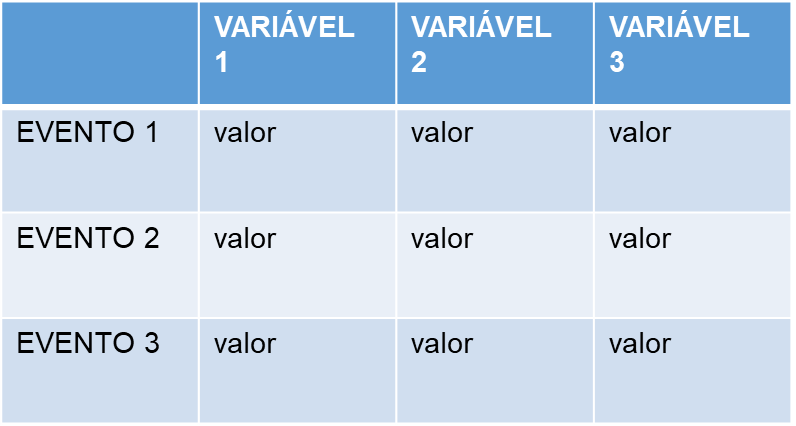

# Modificar dados no excel

É comum usar as planilhas do excel em quase todos os processos em que se trabalha. Seja como controle de dados para alimentar (input) um sistema online ou da PRODEMGE (terminais), ou como registro de conclusões de operações nesses sistemas (outputs), as planilhas são ferramentas úteis.

Mas nem sempre se conhece todas as oções de ferramentas embutidas no excel. Afinal, são inúmeras! Então, saber utilizar um potencial maior dessas ferramentas pode facilitar, e muito, a automatização de processos!

Como exemplos:

- extrair parte do valor de uma cadeia de caracteres ou números;
- concatenar valores de duas colunas em uma nova
- transformar formatos de valores;
- transpor valores;
- comparar valores e checar coincidências ou contar ocorrências 

Nesse post algumas dessas possibilidades serão exemplificadas.

<!-- more -->

A primeira questão para se fazer um uso otimizado do excel é utilizar a planilha como tabela, de fato, e não como texto corrido (word, pdf) - formas não-estruturadas de registro. Isso implica em anotar dados de um evento em cada linha, e os valores de cada uma de suas variáveis em uma coluna separada:

Valores mesclados, células coloridas, valores de linhas preenchidas em colunas a mais que o cabeçalho são usos fora do padrão tabular, estruturado, que dificultam o trabalho de automatizar (que se constitui, na verdade, em elaborar regras para o programa Power Automate executar repetidamente no lugar de uma pessoa). 

A função de coletar parte da cadeia de valores de uma célula:
`=direita(a2;3)`, por exemplo, vai retornar os 3 caracteres/algarismos da direita para a esquerda da célula `a2`. Ela pode ser útil em casos em que a notação de `CNPJ` ou fonte de receita `GFIMP` está com notação diferente entre a planilha e o sistema a ser utilizado.

- concatenar valores de duas colunas em uma nova
- transformar formatos de valores;
- transpor valores;
- comparar valores e checar coincidências ou contar ocorrências

# Saiba Mais

O tutorial da Microsoft sobre esse assunto pode ser acessado [nesta página]().

Um guia compreensivo de erros e problemas recorrentes em planilhas está disponível [neste link](https://escoladedados.org/tutoriais/guia-quartz-para-limpeza-de-dados/).

Para aprofundar sobre formatos de arquivos estruturados, suas sintaxes e como são representados em [especificações de metadados](https://transparencia-mg.github.io/manual-dados-mg/0.1/2.%20Ciclo%20de%20publica%C3%A7%C3%A3o%20de%20dados/007_documentacao/#metadados-no-portal-de-dados-abertos-de-minas-gerais)   