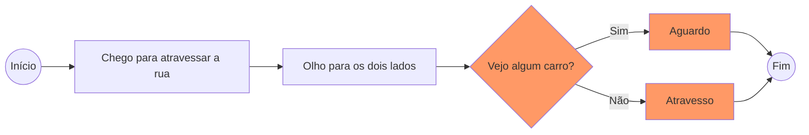
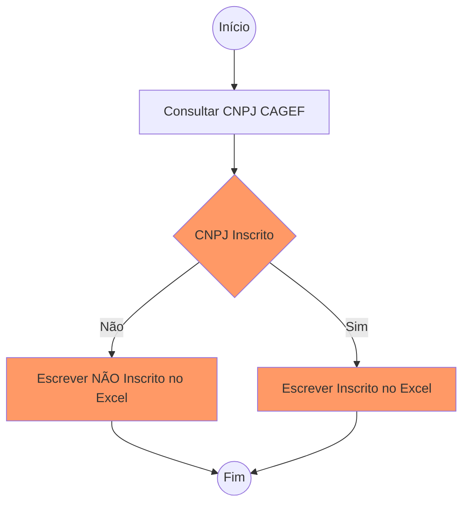
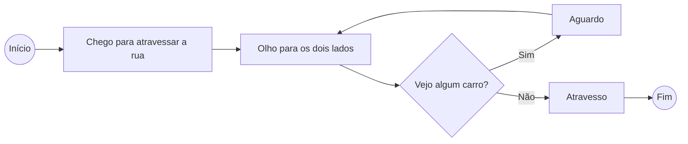
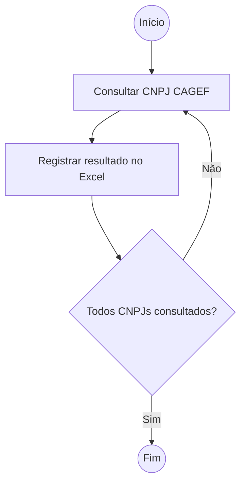

# Introdução Power Automate

Num cenário governamental que demanda eficácia, transparência e agilidade, a automação surge como uma peça-chave para otimizar operações no setor público.
Junte-se a nós em uma jornada para descobrir como o **Power Automate**[^1] pode desempenhar um papel crucial na modernização e aprimoramento de operações repetitivas.
Ao abraçar essa tecnologia, ganhamos tempo, nosso recurso mais preciosos, melhoramos a eficiência operacional e, em última análise, oferecemos serviços públicos com maior qualidade.


<!-- more -->

Desenvolvido pela Microsoft, o Automate emerge como ferramenta essencial na criação automatizações.
Este post visa explorar como simplificar procedimentos, integrar sistemas e agilizar processos de trabalho.
Nossa intenção aqui é ser prático, então a demonstração do básico necessário será feito via automatização de um fluxo real.

## Intrudução ao fluxo

Nosso cenário em foco é a necessidade de consultar a situação cadastral de CNPJs presentes em uma planilha do Excel e registrar os resultados obtidos no mesmo arquivo.
Esta tarefa, apesar de aparentemente simples, ilustra a potência e a utilidade do Automate no contexto da administração pública.
Uma planilha Excel, composta por CNPJs na coluna A, será a base de todo nosso trabalho.
A coluna B abrigará os resultados das pesquisas no CAGEF (Cadastro Geral de Fornecedores do Estado de Minas Gerais).
Ao longo deste capítulo, desvendaremos a construção passo a passo desse fluxo, desde a leitura da planilha até a integração inteligente dos resultados.

??? note "**Clique e veja o fluxo final que será desempenhado por nosso robô**"

    ```mermaid
            --8<-- "docs/blog/posts/20231122_power_automate_ciclo_basico/assets/fluxo_final.md"
    ```

Daremos ênfase à:

- Utilização de ações na construção de fluxos.
- Criação e utilização de variáveis para armazenar dados essenciais ao longo da execução do fluxo.
- Exploração de estruturas condicionais (If/Else) para lidar com diferentes resultados de consulta.
- Criação de estruturas de repetição (Loop) para que a busca aconteça em todos os CNPJs listados na planilha.

Ao compreendermos esses elementos, estaremos preparados para construir qualquer fluxo.

## Ações

São os blocos fundamentais que compõem a estrutura de um fluxo.
Elas representam passos individuais para realização de tarefas específicas e se combinam para formar um processo coeso.
Podem ser localizadas e ou pesquisadas na lateral esquerda do fluxo em construção e, em geral, possuem denominação similar às ações realizadas por nós, humanos.
Podem ser selecionadas com um clique duplo ou simplesmente sendo arrastadas para o fluxo em construção.

Em outras palavras, são como instruções que dizem ao sistema o que fazer em um determinado momento do fluxo.
Ao escolher qual ação queremos, quebramos nosso trabalho (o fluxo completo) em diversas tarefas menores, mais simples e fáceis de serem realizadas.

O Automate oferece uma ampla variedade de ações específicas para diferentes necessidades. Por exemplo, a ação "Enviar E-mail" possibilita a automação de comunicações, enquanto a ação "Aguardar página da Web" garante que a página da web esteja realmente carregada antes de sua manipulação, caso contrário nosso fluxo não executaria com sucesso.

### Exemplos Práticos de Ações[^2]

**Iniciar Novo Chrome**: Peça crucial para interações com navegadores.
Ela cria uma instância do navegador Chrome, permitindo que o fluxo interaja com páginas da web de forma dinâmica.

**Iniciar Excel**: Abre uma instância do Microsoft Excel, proporcionando a base para a manipulação eficiente de dados em planilhas.

**Ler da Planilha Excel**: Com ela podemos extrair dados específicos de uma planilha, como os CNPJs que serão consultados no nosso exemplo. Essa ação possibilita a interação com os dados existentes na instância Microsoft Excel desejada.

## Criação e utilização de variáveis[^3]

A utilização de variáveis desempenha um papel importante na eficiência e adaptabilidade e segurança de nossos fluxos.
Podem ser localizadas na lateral superior direita do fluxo em construção.
Variáveis permitem armazenar e utilizar informações dinamicamente durante a execução de nossos processos automatizados.
Pense nelas como uma caixinhas para guardar dados importantes.

Vamos explorar duas categorias principais de variáveis neste contexto: as variáveis de entrada e as variáveis de fluxo.

### Variáveis de Entrada

Garantem a segurança e a portabilidade do fluxo.
**Local para armazenar informações sensíveis, como logins e senhas, pois evitamos exposição direta desses dados no fluxo, contribuindo para práticas robustas de segurança.**

Além disso, ao utilizar variáveis de entrada para armazenar caminhos de arquivo, facilitamos a utilização do fluxo em diferentes computadores.
Esta prática não apenas aumenta a segurança, mas também simplifica a manutenção e compartilhamento do fluxo entre membros da equipe.

### Variáveis de fluxo

São variáveis criadas a longo do processo de automação.
Podem ser criadas pelo Automate ou por nós mesmos para armazenar informações temporárias.
Por exemplo, durante a interação com um navegador (como o Chrome) é criado uma variável para armazenar a instância do navegador aberto.
O mesmo se aplica durante a interação com o Excel, onde uma variável para armazenar a instância da planilha aberta é igualmente criada.
Também podem ser criadas para resultados de ações diversas, como a extração de dados de texto de páginas web.

Podemos listar uma infinidade de exemplos, mas o importante será entender
como essas variáveis são geradas e utilizadas.
Como boa prática, sugerimos sempre renomear[^4] as variáveis criadas pelo próprio Automate, dando a elas nomes que contenham um significado claro em relação à informação armazenada.
Isso facilitará a construção do fluxo, bem como sua manutenção.

## Estruturas condicionais

As estruturas condicionais do Automate são criadas utilizando-se as ações If e Else.
Elas são semelhantes a divisões de um caminho, permitindo que o fluxo de automação tome decisões com base em condições específicas.
Estas condições direcionam o fluxo do processo de acordo com critérios predefinidos.
Podemos usar o simples ato de atravessar a rua como exemplo.
Antes de atravessar uma rua olhamos para os dois lados. Se (If) vejo algum carro vindo em algum dos lados aguardo e não atravesso. Caso contrário (Else), não havendo nenhum carro avistado, posso atravessar tranquilamente.
Para ilustrar e ou facilitar o entendimento, a estrutura condicional foi destacada de laranja no fluxograma abaixo:



Em nosso caso iremos configurar uma estrutura condicional para verificar se CNPJ consultado está inscrito ou não no CAGEF.
Se (If) sim, registro da informação "Inscrito" em nossa planilha, caso contrário (Else), a informação registrada será "NÃO Inscrito".
Para ilustrar e ou facilitar o entendimento, a estrutura condicional foi destacada de laranja no fluxograma abaixo:



Essas estruturas proporcionam flexibilidade, pois possibilitam a execução de multiplas possibilidades, adaptando a automação conforme as regras do negócio.

## Estruturas de repetição (Loop)

Como o próprio nome indica, são ações criadas com objetivo de repetir determinado processo.
Melhorando nosso exemplo de atravessar a rua, devemos incluir um loop após a etapa aguardar, caso contrário aguardaremos eternamente ou não sairemos do lugar. Após um tempo aguardando, volto a olhar para os dois lados e o processo se repete até o momento que não vejo nenhum carro e posso atravessar a rua com segurança, finalizando o fluxo.



Para o Power Automate, **um loop permite que uma sequência de ações seja executada repetidamente** com base em condições específicas.
É como uma máquina que faz a mesma tarefa várias vezes de forma automática, economizando tempo e esforço.

Utilizaremos um loop em nossa lista de CNPJs afim de realizarmos todas as nossas consultas.
Criaremos a lógica que permitirá ajustar, de maneira dinâmica, o número de repetições de acordo com o número de CNPJs existentes na lista.



??? note "**Crie seu primeiro loop no Automate**"

    ```mermaid
            --8<-- "docs/blog/posts/20231122_power_automate_ciclo_basico/assets/fluxo_final.md"


[^1]: Carinhosamente chamado de Automate deste ponto em diante.
[^2]: Não é nossa intenção aqui explicar todas as ações disponíveis, pois são muitas. Navegue nesta lista e tente, por conta própria, utilizar ações que te chamaram atenção, uma vez que suas configurações são, via de regra, bastante autoexplicativas.
[^3]: Anteriormente abordado [neste post](../20231019_variaveis/index.md).
[^4]: Não utilize espaços e ou caracteres especiais como acentos, cedilha e til, para renomear as variáveis de fluxo. Sugerimos a utilização de letras minúsculas, separadas por underscore (`_`) como em `resultado_pesquisa`.
