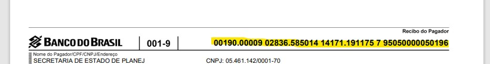
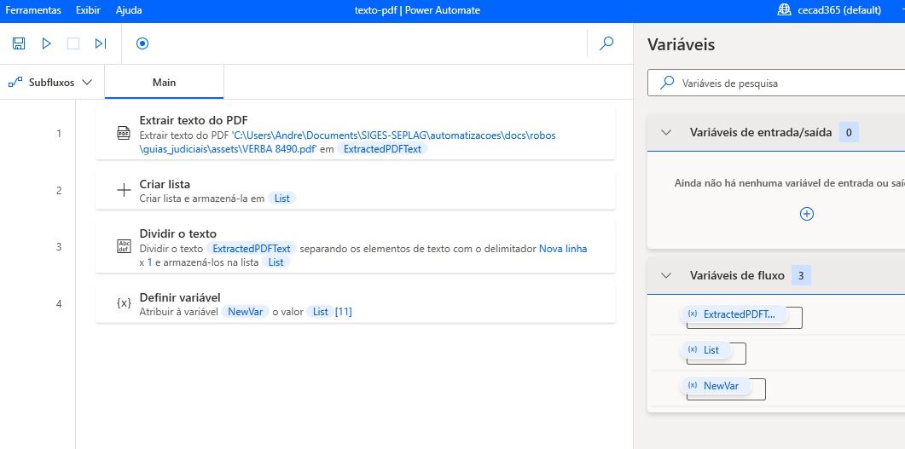
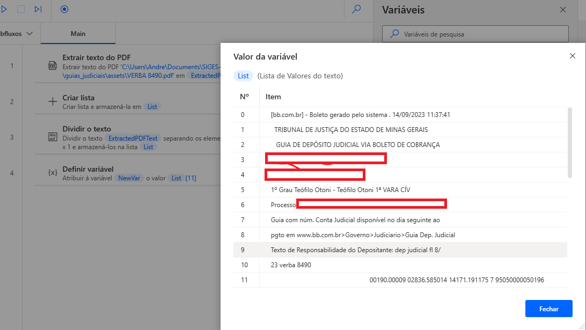

# Como extrair um texto de um arquivo PDF

Neste exemplo, a necessidade é guardar o número do boleto ou guia de pagamento gerada em um arquivo no formato pdf. O número do boleto da imagem abaixo, bem como outras informações deste documento, são extraídas e salvas em formato de tabela.

<!-- more -->

A lista resultante da aplicação deste código no Power Automate aparece como na figura abaixo, e o código de barras do boleto ficou guardado na posição 11 da lista criada:

A parte do código a que fez referência este post:

??? copy "**Código-Fonte**"

        --8<-- "docs/blog/posts/20231129_texto_pdf/assets/texto_pdf.txt"

# Saiba Mais

A página dos guias da Microsoft sobre manipulação de arquivos em PDF pode ser acessada [neste link](https://learn.microsoft.com/pt-br/power-automate/desktop-flows/actions-reference/pdf)
