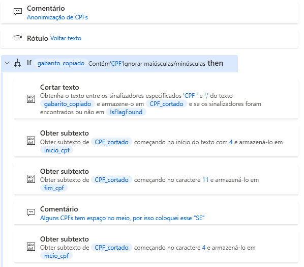
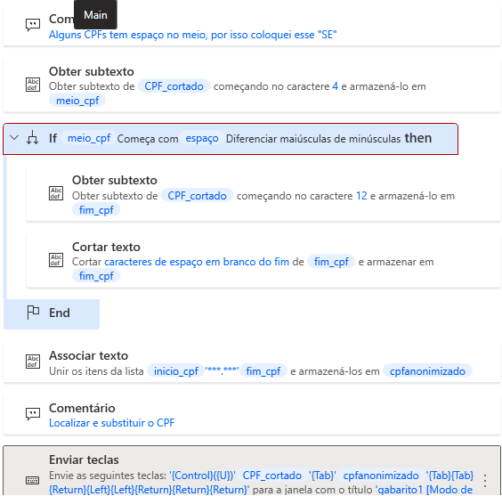
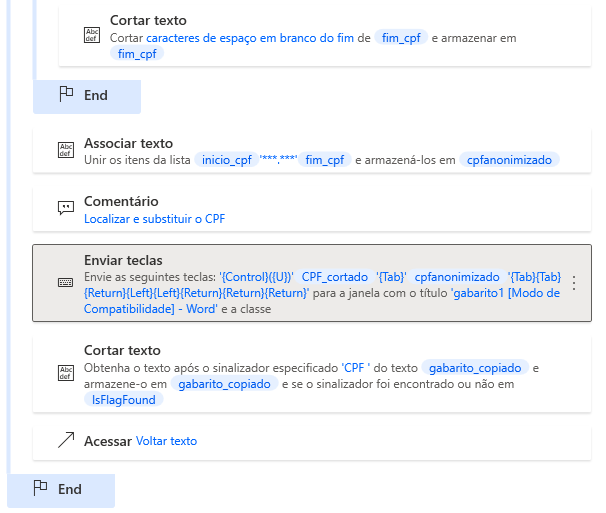

# Como modificar uma expressão regular em um texto

Este caso de uso serve para localizar e substituir CPFs ao longo de um texto a ser enviado para publicação pela Imprensa Oficial. Para isso, é necessário descaracterizar parte da cadeia de caracteres dos CPFs dos servidores que têm atos publicados no Diário Oficial do Estado.

São 2 desafios superados com esse protótipo de robô:

- modificar parte da cadeia de caracteres que formam o CPF;
- realizar o loop buscando a expressão regular do CPF, sem contar com uma variável numérica que esteja presente em uma tabela

<!-- more -->

O texto a ser modificado inclui várias partes obrigatórias e padronizadas, exceto o CPF, que aparece na íntegra, do sistema onde é extraído. Sua notação segue o modelo: `000.000.000-00`

Após descaracterizá-lo para o modelo `xxx.000.000-xx`, é preciso procurar por todos os demais, ao longo do texto. Um loop aumentando a 'variável CPF' não seria aplicável, pois não se trata de uma variável numérica. Assim, a estratégia desse código foi utilizar as ações _ACESSAR Voltar texto_ e _RÓTULO Voltar Texto_:

O produto final é a junção dos atos prontos para serem assinados e enviados para publicação, com os CPFs modificados.

A parte do código a que fez referência este post:

??? copy "**Código-Fonte**"

        --8<-- "docs/blog/posts/20231204_loop_texto/assets/codigo.txt"

# Saiba Mais

A página dos guias da Microsoft sobre manipulação de texto pode ser acessada [neste link](https://learn.microsoft.com/pt-br/training/modules/pad-text-manipulation/).

Para estudar a criação e a execução de loops, acesse [esta página](https://learn.microsoft.com/pt-br/training/modules/pad-loops/)
