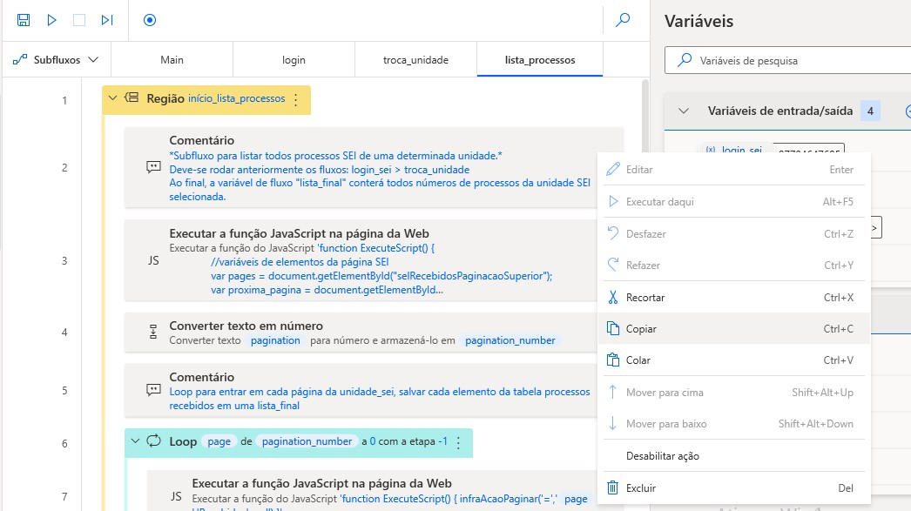
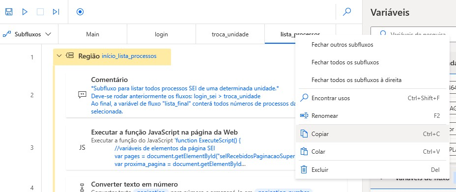
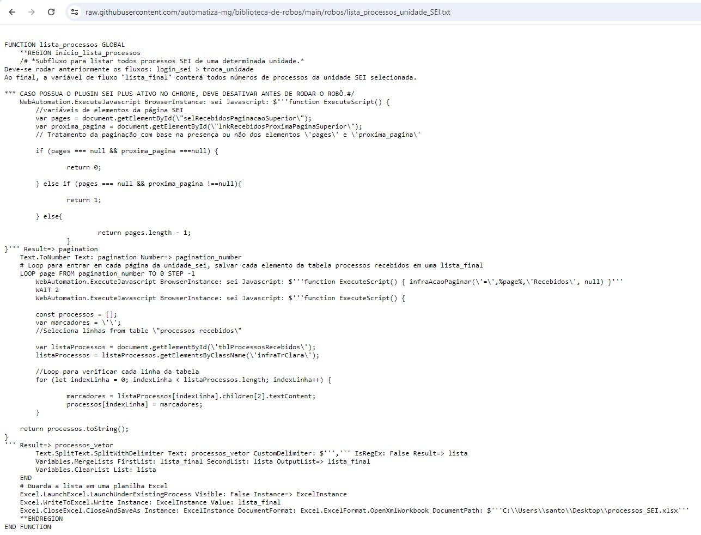
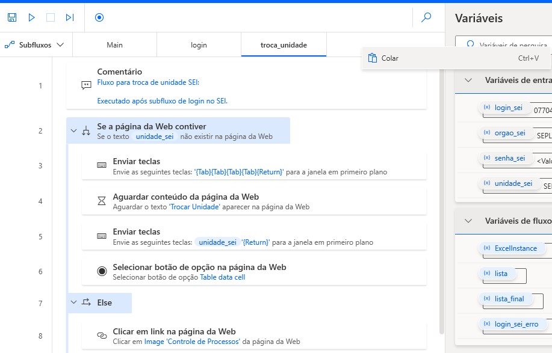

# Copiando código de subfluxos de un robô 

Uma das estratégias na montagem das ações de um robô no Power Automate pode ser o seu particionamento em **Subfluxos**. Nesse caso, é preciso ter alguns cuidados ao compartilhar o código contido em um subfluxo, quando se está usando a licença mais básica do programa. 

<!-- more -->

[Neste post](https://learn.microsoft.com/pt-br/power-automate/desktop-flows/how-to/share-export-desktop-flows), a própria Microsoft recomenda, para compartilhar o código de um robô, selecionar todas as linhas de código dele, copiar e colar num editor de texto. Poderíamos utilizar, para isso, o mouse, ou as teclas Control{A} + Control{C}, que selecionariam tudo e copiariam o conteúdo selecionado:

Quando o código está dividido em **Subfluxos**, há uma outra maneira, talvez mais prática, clicando com o botão direito do mouse na aba do nome do subfluxo:

Entretanto, essa maneira pode gerar dificuldades, pois, ao colar esse conteúdo em um arquivo `.txt`, são criadas linhas nesse código, nomeadas por FUNCTION, que delimitam o início e o final do subfluxo: 

Caso esse arquivo `.txt` seja copiado integralmente, não será possível colar as linhas de código contidas no subfluxo, ao clicar na interface de inclusão de ações, com o botão direito do mouse ou com o Control{V}. Nesse caso, será necessário clicar com o botão direito do mouse no espaço vazio da inclusão de subfluxos:

O código deste post encontra-se disponível na nossa bibiloteca de robôs e pode ser acessado diretamente [neste link](https://raw.githubusercontent.com/automatiza-mg/biblioteca-de-robos/main/robos/lista_processos_unidade_SEI.txt).

# Saiba Mais

Explore canais e materiais de referência para aprofundar seus conhecimentos sobre o **Power Automate**:

- [Documentação Oficial](https://docs.microsoft.com/pt-br/power-automate/)
- [Canal do Power Automate no YouTube](https://www.youtube.com/channel/UCG98S4lL7nwlN8dxSF322bA)
- [Comunidade Power Automate](https://powerusers.microsoft.com/t5/Power-Automate-Community/ct-p/MPACommunity)
