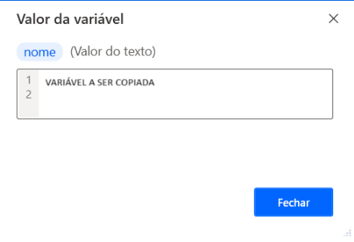
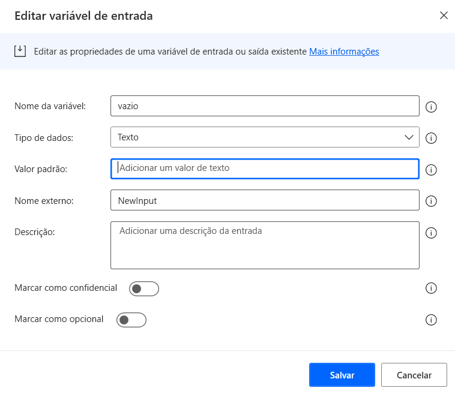
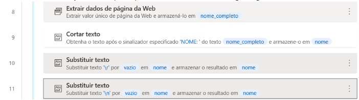

# Retirada de linhas adicionais (escaping) em textos copiados da Web

Um dos riscos que podemos correr na operação de robôs, ao copiar dados ou textos diretamente na Web, é trazer linhas ocultas ao olhar humano, junto da variável que capturou o texto. Este post contém uma dica para contornar essa armadilha e seguir em frente com o fluxo no Power Automate, usando apenas a linha desejada.  

<!-- more -->

O caso prático em questão é como retirar uma linha 'indesejável' de um texto capturado como variável. O exemplo genérico para a situação seria:

- variável capturada
````
VARIÁVEL A SER COPIADA
(Linha vazia indesejável)
````
- variável desejada
````
VARIÁVEL A SER COPIADA
````

Ações `Extrair dados da página da WEB` e `Cortar texto` podem apresentar problemas, como variável copiada com linha adicional. Isso ocorre pela estrutura da página da Web, ou se não especificamos bem o que copiar da página.
Talvez haja uma linha adicional que pode ser verificada clicando duas vezes na variável criada, como na figura 
exemplo:



Caso essa linha adicional passe desapercebida, se parte desse texto for usado como variável para dar nome a um arquivo, provavalmente vai gerar um erro no momento da ação de _salvar como_, na interface gráfica do Windows.

## Alternativa

Em textos ou tabelas, as linhas podem sofrer quebras, ter espaços, dentre outros, que são identificados por alguns sinais convencionais:

````
\r (return)
\n (new line)
\t (tab)
\s (space)
````
Tendo isso em vista, foram adicionadas:

I. uma variável de entrada com nome 'vazio' e valor padrão em branco :



II. duas ações (10 e 11) para suprimir a linha adicional mostrada na figura anterior:



Após a ação da linha 11 acima, o texto passa a exibir somente a primeira linha. As partes do código correspondentes às ações das linhas 10 e 11 seguem abaixo, para cópia e reúso:

````
Text.Replace Text: nome TextToFind: $'''\\r''' IsRegEx: True IgnoreCase: False ReplaceWith: vazio ActivateEscapeSequences: True Result=> nome
Text.Replace Text: nome TextToFind: $'''\\n''' IsRegEx: True IgnoreCase: False ReplaceWith: vazio ActivateEscapeSequences: True Result=> nome

````

# Saiba Mais

Explore canais e materiais de referência para aprofundar seus conhecimentos sobre o **Power Automate**:

- [Documentação Oficial](https://docs.microsoft.com/pt-br/power-automate/)
- [Canal do Power Automate no YouTube](https://www.youtube.com/channel/UCG98S4lL7nwlN8dxSF322bA)
- [Comunidade Power Automate](https://powerusers.microsoft.com/t5/Power-Automate-Community/ct-p/MPACommunity)
