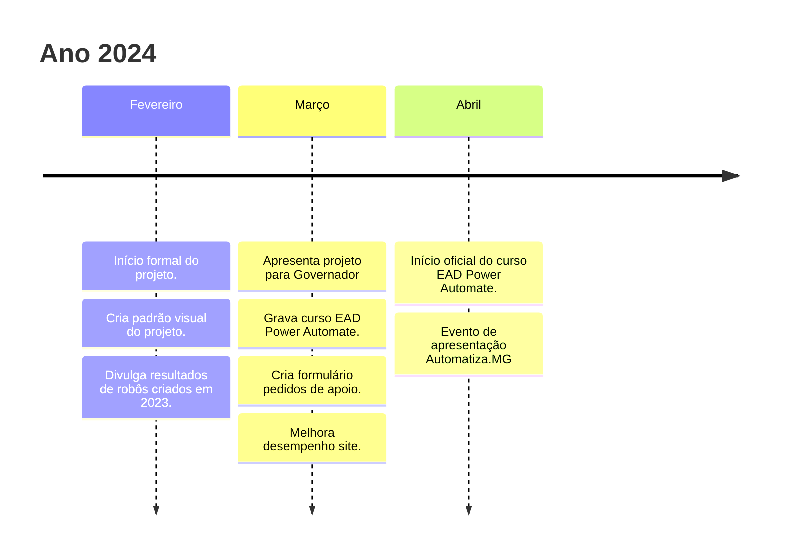
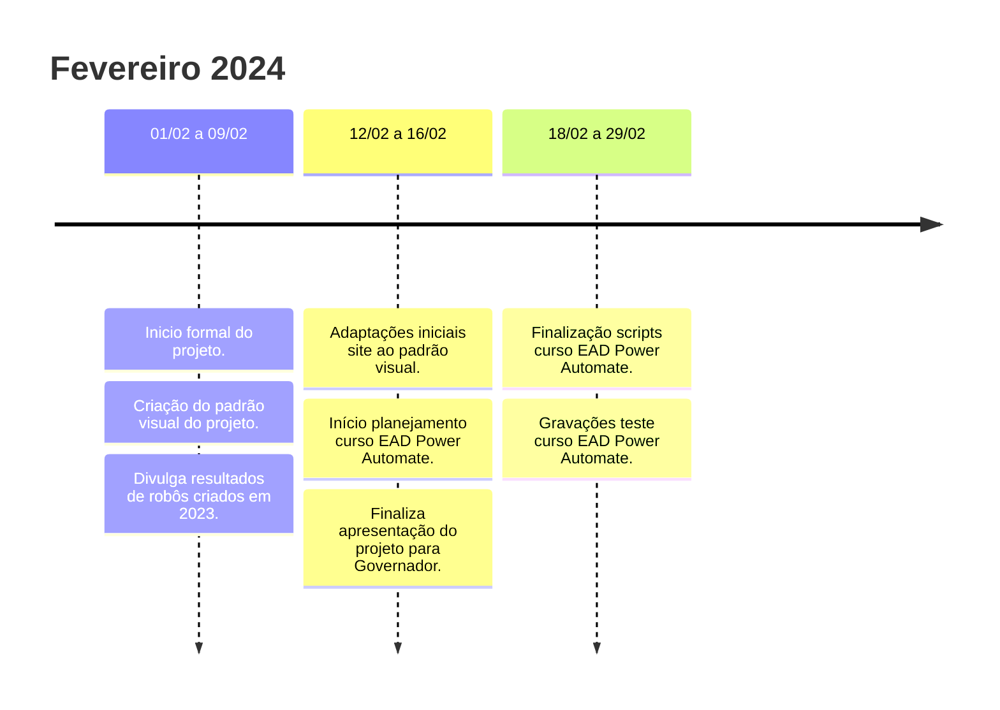
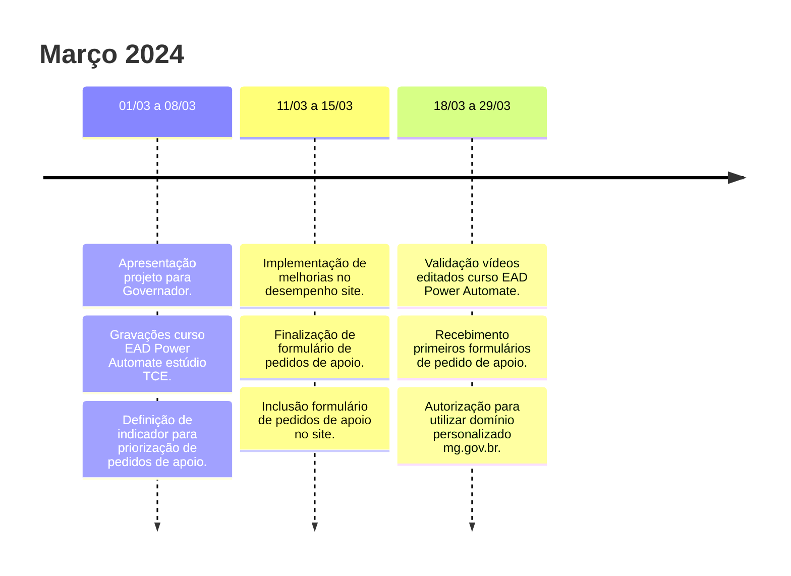
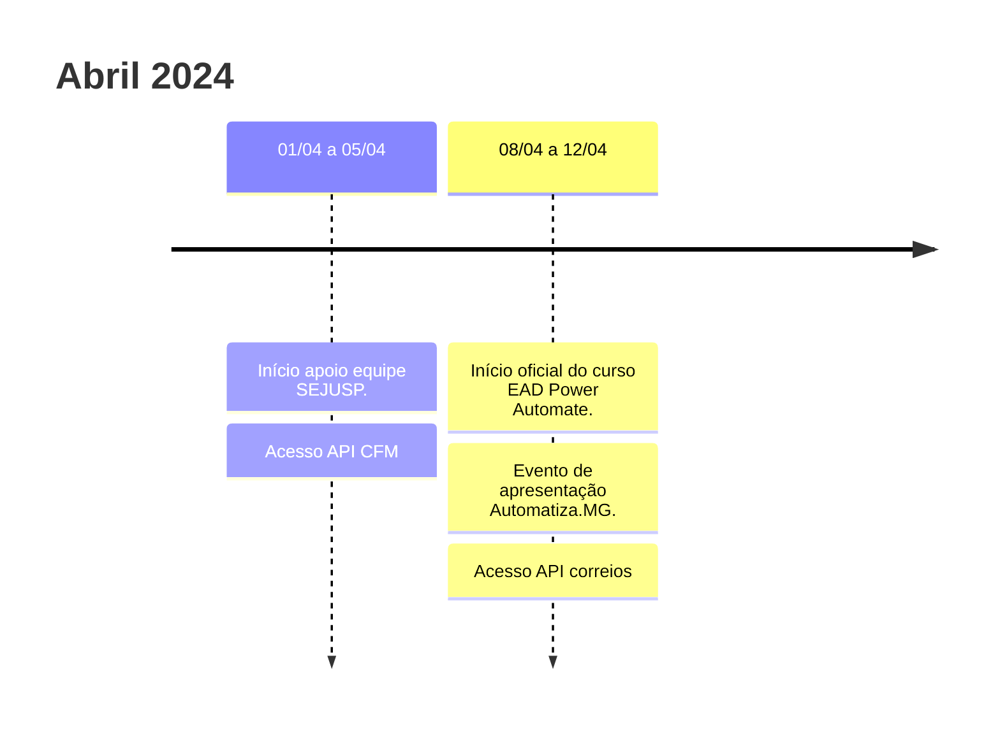

# FJP

O projeto [Automatiza-MG](https://automatiza-mg.github.io/automatizacoes/) consiste em uma séria de ações para disseminar a utilização de ferramentas de Automatizações de processos do Estado de Minas Gerais. Principais entregas:

- Curso EAD de Power Automate.
- [Biblioteca de robôs](https://automatiza-mg.github.io/automatizacoes/robos/).
- Divulgação ampla do projeto, potencial de utilização e resultados.

A documentação que detalha todas as ações e produtos finais pode ser encontrada:

- Na tag [Automatiza-MG](../../tags/#automatiza-mg).
- No [repositório GitHub](https://github.com/automatiza-mg/automatizacoes) criado para hospedar o site do projeto.
- Neste [GitHub Project Board](https://github.com/orgs/automatiza-mg/projects/1/views/15).

??? example "Expand to show alternate icon sets"

    === ":octicons-mark-github-16: Octicons"

        ``` yaml
        theme:
          icon:
            admonition:
              note: octicons/tag-16
              abstract: octicons/checklist-16
              info: octicons/info-16
              tip: octicons/squirrel-16
              success: octicons/check-16
              question: octicons/question-16
              warning: octicons/alert-16
              failure: octicons/x-circle-16
              danger: octicons/zap-16
              bug: octicons/bug-16
              example: octicons/beaker-16
              quote: octicons/quote-16
        ```


    === ":fontawesome-brands-font-awesome: FontAwesome"

        ``` yaml
        theme:
          icon:
            admonition:
              note: fontawesome/solid/note-sticky
              abstract: fontawesome/solid/book
              info: fontawesome/solid/circle-info
              tip: fontawesome/solid/bullhorn
              success: fontawesome/solid/check
              question: fontawesome/solid/circle-question
              warning: fontawesome/solid/triangle-exclamation
              failure: fontawesome/solid/bomb
              danger: fontawesome/solid/skull
              bug: fontawesome/solid/robot
              example: fontawesome/solid/flask
              quote: fontawesome/solid/quote-left
        ```

  [custom icon]: ../setup/changing-the-logo-and-icons.md#additional-icons
  [supported types]: #supported-types
  [icon search]: icons-emojis.md#search

## Visão Geral



## Visão mensal detalhada







