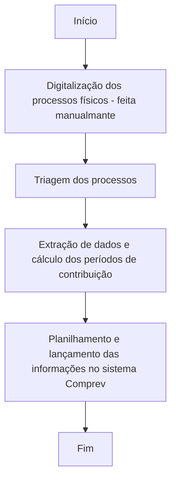

# Automatização da análise documental de aposentadoria

O desafio em questão consiste em automatizar a triagem dos processos e, posteriormente, a leitura e extração de informações dos documentos de aposentadoria para fins de compensação previdenciária.

<!-- more -->
## 1. Sobre o projeto
O processo da compensação previdenciária envolve diversas etapas até o recebimento dos recursos da União por parte do Estado. Em primeiro lugar, os processos devem ser digitalizados e depois triados, a fim de que apenas os documentos relativos a aposentadoria e compensação sejam separados. Posteriormente, extraem-se deles as informações necessárias de compensação, como o tipo de aposentadoria, informações pessoais sobre o aposentado, datas e cálculos de períodos de contribuição por regime previdenciário. Por fim, essas informações são lançadas no sistema federal COMPREV para que a União possa processar os créditos a pagar.

Antes feito de maneira manual, o intuito foi o de otimizar esse processo. Agora, depois de digitalizados, esses processos passam sob a análise de uma série de 17 IAs, robustamente construídas e testadas a fim de conseguirem compreender a natureza dos documentos, contextualizar de onde cada informação deve ser retirada e fazer os cálculos pertinentes de acordo com a legislação vigente. Tais IAs têm como base fluxos da ferramenta Power Automate web.

## 2. O que o robô faz
Dentre as IAs construídas, estão as de:

- Triagem dos documentos: verifica CPF, data de publicação de aposentadoria (pré ou pós 1988) e contribuição para o INSS ou INPS;
- Seleção dos documentos pertinentes: Certidão de Tempo de Contribuição (CTC) do Estado (chamada de Mapa de aposentadoria) e do INSS, Ato de aposentadoria, Homologação, e Renda;
- Verificação de datas da CTC;
- Cálculo de datas de contribuição;
- Análise da CTC do Estado (Mapa): 
    - IA especialista para calcular o tempo total de contribuição;
    - IA especialista para calcular o tempo de contribuição não pertinente ao Estado;
    - IA que separa o tempo de contribuição de INSS e municípios.
- Extração de datas do Ato de aposentadoria. 
- Extração de informações pessoais: CPF, MASP, carreira etc;
- Separação de datas sobrepostas;
- Análise de Renda de aposentadoria;
- Verificação de data de homologação e identificação de Secretaria;
- Verificação da legislação pertinente à legislação dentro do Ato de aposentadoria;

## 3. Como funciona o robô
Por se tratar de um fluxo online, o robô já está programado para rodar automaticamente, sendo o gatilho para esta ação a inclusão de novas faturas na pasta do _Sharepoint_ designada para tal.

Especificamente para a triagem, foi construído um sistema de lançamento para uso do setor demandante. Mediante login, os servidores responsáveis conseguem fazer o upload do lote de processos a serem triados e já receber o retorno no mesmo sistema após processamento.

_[inserir aqui segundo print da tela do sistema]_

O lançamento dos dados no sistema Comprev começou a ser feito internamente, mas, atingido o limite imposto pelo servidor do site, atualmente busca-se junto à Dataprev uma forma de integração para os lançamentos.

Veja o fluxo do robô:

## 4. Premissas

- Processos seguem sendo digitalizados manualmente, pela própria equipe demandante ou por empresa especializada.
- Alinhamento para com os demandantes acerca de erros eventuais na extração ou em cálculos feitos pelas IAs: minimizados pelas múltiplas rodadas de teste, porém ainda possíveis. Aquilo que for lançado de maneira incorreta retorna ao ente pelo próprio Comprev e é corrigido manualmente pela equipe demandante. 

## 5. Utilização do robô
- Para usar o robô, devem ser inseridos processos na pasta do _Sharepoint_ designada para tal. Cada processo resultará em uma nova linha na planilha de controle após as análises.
- O sistema de triagem foi compartilhado com a equipe, para que o gatilho desta parte do fluxo ocorra por meio dos uploads e também resulte na separação pretendida.  

## 6. Resultados

Com a automatização, o processo mencionado ficou cerca de 13.7 vezes mais rápido! Até então, isso representa um total de 1610 horas economizadas e 183,7 milhões de reais arrecadados. :rocket:

