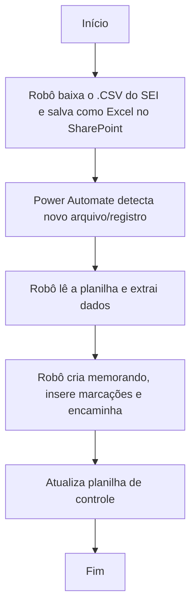

# Automatização do tratamento inicial de manifestações da OGE

O desafio em questão consistia em automatizar a pré-análise e o encaminhamento inicial das demandas de manifestações oriundas da Ouvidoria-Geral do Estado (OGE) que chegam à Diretoria de Atendimento Jurídico (DAJ) - SEJUSP, replicando o fluxo de trabalho do setor administrativo (ADM) da DAJ.

<!-- more -->

A Diretoria recebe demandas de manifestações da OGE, que requerem uma análise e uma resposta subsequente ao demandante. Tradicionalmente, o Setor ADM da DAJ realiza a pré-análise e o tratamento inicial dos processos, que envolvem as seguintes etapas manuais:

- Criação de um memorando inicial;
- Encaminhamento à Unidade competente para solicitação de informações que subsidiem a resposta;
- Inserção de marcador (tag) para a pessoa responsável no núcleo específico;
- Inserção do CPF do responsável e inclusão no bloco de assinatura;
- Encaminhamento final à unidade com um prazo de retorno estabelecido.

## 1. O que a automatização faz

- [x] Faz a baixa do relatório ``.CSV`` que contém todos os processos recebidos da Diretoria DAJ.
- [x] Realiza a leitura do relatório/planilha, identificando e extraindo as informações desejadas em um formato pré-definido.
- [x] Cria o memorando inicial inserindo as informações pré-definidas.
- [x] Realiza as marcações necessárias (marcador e CPF do responsável) no processo.
- [x] Atualiza a planilha de controle de processos.
- [x] Encaminha o processo para a unidade responsável.

## 2. Como funciona? Passo a passo explicado do Automate

Essa automatização é constituída por 2 robôs, sendo um robô no Power Automate Desktop (PAD) e um no Power Automate Web (PAW).

**Fase 1 (Coleta)**: O robô entra no SEI, baixa o arquivo ``.CSV`` com todos os processos e o transforma em uma planilha Excel. Esta planilha é então salva em uma pasta específica do *SharePoint*.

**Fase 2 (Tratamento)**: Por se tratar de um fluxo RPA e online, o robô está programado para rodar automaticamente. O **gatilho** para a segunda fase é a inclusão de novas planilhas/registros na pasta do *SharePoint* após a conclusão da primeira fase. Cada processo tratado resultará em uma nova atualização na planilha de controle.
 
O robô processa os documentos de forma inteligente e eficiente. Veja o fluxo automatizado:

 

 

## 3. Utilização do robô

Antes de executar o robô, **o(a) usuário(a) deverá adicionar as seguintes variáveis de entrada**:

- :material-application-variable: **`login_sei`**: inserir o CPF do usuário.
- :material-application-variable: **`senha_sei`**: inserir a senha do usuário.
- :material-application-variable: **`orgao_sei`**: inserir o órgão em que o usuário está vinculado.
- :material-application-variable: **`Pasta_Download`**: inserir o caminho da pasta em que os arquivos CSV estão armazenados.
- :material-application-variable: **`Nome_Excel_Controle`**: inserir o nome do arquivo de controle que será utilizado para gerar o caminho da planilha do excel. 
- :material-application-variable: **`Especificação_Desejada`**: inserir o tipo de especificação desejada como filtro de seleção dos processos.
- :material-application-variable: **`Coluna_Processo`**: inserir coluna da planilha de controle em que será registrado o número do processo.
- :material-application-variable: **`Coluna_Data`**: inserir coluna da planilha de controle em que será registrada a data da execução.
- :material-application-variable: **`Tipo_Desejado`**: inserir o tipo de documento desejado como filtro de seleção.
- :material-application-variable: **`pasta_onedrive`**: inserir o caminho da pasta no Onedrive em que os arquivos serão salvos.

Outras observações:

- O fluxo é programado para interagir com o SEI e planilhas em um formato específico. Quaisquer alterações significativas no layout ou no processo do SEI podem exigir reajustes.
- As planilhas de entrada precisam estar em um formato padronizado (ou ser o arquivo .CSV original do SEI) para garantir a correta leitura e extração dos dados.
- As expressões de inserção de dados e marcações foram ajustadas para lidar com o padrão de informações do sistema e os campos obrigatórios.

## 4. Resultados
 - Processo manual: cerca de 5 minutos para tratamento de um processo.
 - Processo automatizado: cerca de 10 segundos para tratamento de um processo.

## 5. Códigos
1. Fluxo [Main](https://raw.githubusercontent.com/automatiza-mg/biblioteca-de-robos/refs/heads/main/robos/site/manifestacao_oge/main_oge).
2. Fluxo [Login_sei](https://raw.githubusercontent.com/automatiza-mg/biblioteca-de-robos/refs/heads/main/robos/site/login_sei.txt).
3. Fluxo [Excel](https://raw.githubusercontent.com/automatiza-mg/biblioteca-de-robos/refs/heads/main/robos/site/manifestacao_oge/excel).

