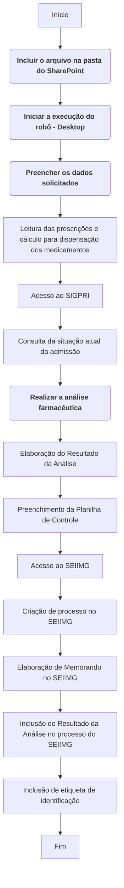

# FarmacIA - Robô de Análise de Psicotrópicos​

O desafio consiste em automatizar a análise farmacêutica das prescrições de psicotrópicos, que são encaminhadas para a Diretoria de Saúde Prisional do Departamento Penitenciário de Minas Gerais.

Para isso, foi criado um fluxo automatizado utilizando a ferramenta Power Automate (versões Web e Desktop). Após a digitalização dos receituários, o robô realiza a leitura das prescrições, identificando os medicamentos padronizados, calculando a posologia diária e a quantidade a ser dispensada. O robô também tem a funcionalidade de consultar o número do INFOPEN (quando presente na prescrição) no Sistema Integrado de Gestão do Sistema Prisional (SIGPRI), verificando a situação atual da admissão dos privados de liberdade.

Em um segundo momento, uma planilha modelo é preenchida automaticamente, permitindo a conferência das informações lançadas. Posteriormente, o robô cria um processo no Sistema Eletrônico de Informações (SEI!MG), elabora um memorando de encaminhamento para a Central de Abastecimento Farmacêutico e anexa o documento com o 'Resultado da Análise'. O processo é remetido, também, para a respectiva unidade prisional.

Caso sejam verificadas divergências relacionadas à admissão de privados de liberdade, o robô elabora uma lista de pendências e um memorando específico.

<!-- more -->
## 1. O que o robô faz
- [x] Realiza a leitura das prescrições de psicotrópicos.
- [x] Identifica os medicamentos padronizados.
- [x] Identifica a posologia diária.
- [x] Calcula a quantidade de medicamento a ser fornecida.
- [x] Acessa o SIGPRI e verifica a situação atual da admissão dos privados de liberdade.
- [x] Preenche a Planilha de Controle.
- [x] Cria o um novo processo no SEI!MG.
- [x] Elabora o Memorando de encaminhamento para a CAF e unidade prisional.
- [x] Insere o Resultado da Análise no processo.

## 2. Como funciona? Passo a passo explicado do Automate

O robô já está programado para rodar automaticamente, sendo o gatilho para esta ação a inclusão de arquivo `.PDF ` (contendo as prescrições digitalizadas) na pasta do Sharepoint designada para tal. Após isso, o usuário inicia o fluxo no Power Automate Desktop e segue as instruções.

Veja o fluxo do robô:

**As ações em destaque necessitam da interferência do(a) usuário(a).**

## 3. Utilização do robô
- Antes de executar o robô, **o(a) usuário(a) deverá adicionar as seguintes variáveis de entrada**:
- :material-application-variable: **`link_planilha_robo`**: inserir o link da planilha online que recebe o resultado da leitura do robô.
- :material-application-variable: **`login_sei`**: inserir o CPF do usuário.
- :material-application-variable: **`login_sigpri`**: inserir o CPF do usuário.
- :material-application-variable: **`orgao_sei`**: inserir o órgão utilizado para acessar o SEI!MG.
- :material-application-variable: **`pasta_download`**: inserir o caminho de armazenamento dos arquivos baixados no computador.
- :material-application-variable: **`pasta_prescricoes`**: link da pasta do Sharepoint que reconhece as prescrições.
- :material-application-variable: **`planilha_controle`**: inserir o link da planilha de Controle de Recebimento de Prescrições.
- :material-application-variable: **`planilha_modelo_analise`**: local de armazenamento da Planilha Modelo de Análise de Prescrições.
- :material-application-variable: **`senha_sei`**: inserir a senha utilizada para acessar o SEI!MG.
- :material-application-variable: **`senha_sigpri`**: inserir a senha utilizada para acessar o SIGPRI.
- :material-application-variable: **`tipo_processo`**: inserir o tipo do processo a ser criado.
- :material-application-variable: **`unidade_sei`**: inserir a unidade utilizada para acessar o SEI!MG.

- O robô abrirá todos os arquivos necessários e páginas da Web, assim, **certifique-se que o Excel e/ou o navegador não estejam abertos**.
- Verifique, no navegador, se a extensão do Power Automate está habilitada.
- Ative a opção `mostrar pop-ups e redirecionamentos do navegador`.
- Desative a opção `mostrar os downloads quando eles forem concluídos`.

## 4. Resultados
 - Processo manual: cerca de 3 horas para a análise completa de 100 prescrições.
 - Processo automatizado: cerca de 40 minutos para a análise completa de 100 prescrições.

## 5. Códigos
- Fluxo ['Main'](https://raw.githubusercontent.com/automatiza-mg/biblioteca-de-robos/refs/heads/main/robos/sejusp_depen_farmaco/main.txt)
- Fluxo ['atualizar_planilha_controle'](https://raw.githubusercontent.com/automatiza-mg/biblioteca-de-robos/refs/heads/main/robos/sejusp_depen_farmaco/atualizar_planilha_controle.txt)
- Fluxo ['criar_memorando_sei'](https://raw.githubusercontent.com/automatiza-mg/biblioteca-de-robos/refs/heads/main/robos/sejusp_depen_farmaco/criar_memorando_sei.txt)
- Fluxo ['criar_processo_sei'](https://raw.githubusercontent.com/automatiza-mg/biblioteca-de-robos/refs/heads/main/robos/sejusp_depen_farmaco/criar_processo_sei.txt)
- Fluxo ['editar_planilha_modelo'](https://raw.githubusercontent.com/automatiza-mg/biblioteca-de-robos/refs/heads/main/robos/sejusp_depen_farmaco/editar_planilha_modelo.txt)
- Fluxo ['inserir_anexo'](https://raw.githubusercontent.com/automatiza-mg/biblioteca-de-robos/refs/heads/main/robos/sejusp_depen_farmaco/inserir_anexo.txt)
- Fluxo ['inserir_dados'](https://raw.githubusercontent.com/automatiza-mg/biblioteca-de-robos/refs/heads/main/robos/sejusp_depen_farmaco/inserir_dados.txt)
- Fluxo ['login_sei'](https://raw.githubusercontent.com/automatiza-mg/biblioteca-de-robos/refs/heads/main/robos/sejusp_depen_farmaco/login_sei.txt)
- Fluxo ['salvar_planilhas'](https://raw.githubusercontent.com/automatiza-mg/biblioteca-de-robos/refs/heads/main/robos/sejusp_depen_farmaco/salvar_planilhas.txt)
- Fluxo ['trocar_unidade_sei'](https://raw.githubusercontent.com/automatiza-mg/biblioteca-de-robos/refs/heads/main/robos/sejusp_depen_farmaco/trocar_unidade_sei.txt)
- Fluxo ['login_sigpri'](https://raw.githubusercontent.com/automatiza-mg/biblioteca-de-robos/refs/heads/main/robos/sejusp_depen_farmaco/login_sigpri.txt)
- Fluxo ['pesquisar_infopen'](https://raw.githubusercontent.com/automatiza-mg/biblioteca-de-robos/refs/heads/main/robos/sejusp_depen_farmaco/pesquisar_infopen.txt)
- Fluxo ['criar_memo_inadmissao'](https://raw.githubusercontent.com/automatiza-mg/biblioteca-de-robos/refs/heads/main/robos/sejusp_depen_farmaco/criar_memo_inadmissao.txt)