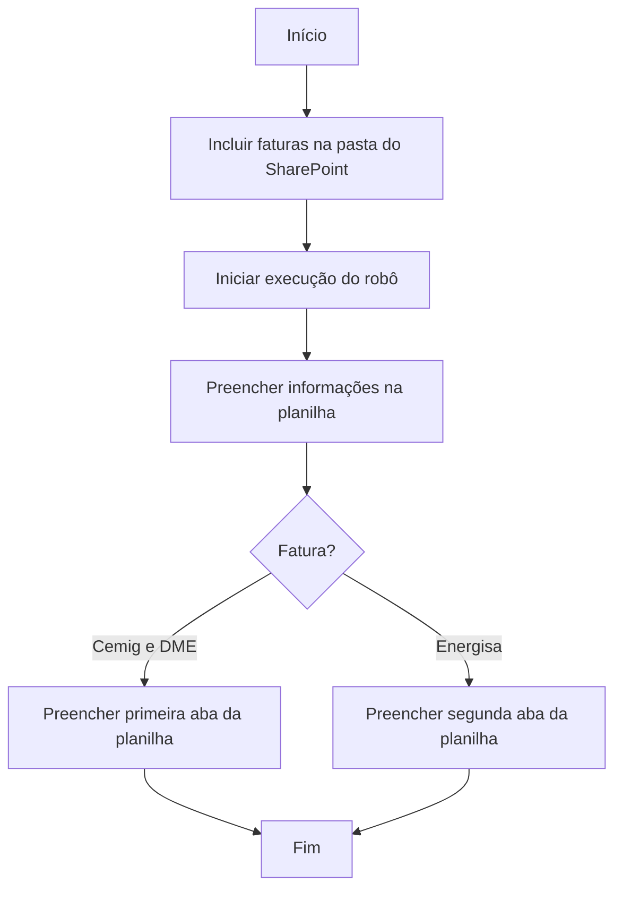

# Automação de leitura de fatura de energia elétrica - baixa tensão

O desafio em questão consiste em automatizar a leitura, a extração de informações e gerar uma base de dados de mais de 200 faturas de energia elétrica de baixa tensão que a Sejusp recebe mensalmente.

<!-- more -->
## 1. Sobre o projeto
A Sejusp conta com uma ampla rede de unidades administrativas espalhadas pelo território de Minas Gerais. Dentre os serviços contratados para operação destas unidades, está o fornecimento de energia elétrica (baixa tensão). Atualmente, 04 concessiónárias fornecem esse serviço, resultando no envio de cobranças mensais (fatura).

A gestão dessa faturas é centralizada na Diretoria de Serviços Gerais (DSG), que coleta as informações de cada uma das faturas para sua gestão financeira, o que envolve os processos empenho, liquidação e pagamento destas. Considerando o volume de faturas mensais, este trabalho demanda bastante tempo e esforço da equipe responsável.

Diante dessa situação, criamos um fluxo automatizado utilizando a ferramenta de Automação Robótica de Processos - RPA[^1], _Power Automate Web_ com o superte de Inteligência Artificial. 

## 2. O que o robô faz
 - Realiza leitura da fatura de energia, identificando as informações que desejamos coletar;
 - Extrai informações solicitadas em formato pré definido; 
 - Insere informações em planilha estruturada;
 - Calcula o _score_ que indica o nível de acuracidade (0-100) na leitura da fatura.

## 3. Como funciona o robô
Por se tratar de um fluxo online, o robô já está programado para rodar automaticamente, sendo o gatilho para esta ação a inclusão de novas faturas na pasta do _Sharepoint_ designada para tal.

Veja o fluxo do robô:

## 4. Premissas

- O fluxo funciona para os modelos de fatura que foram utilizados no treinamento da IA. No caso, faturas da concessionária Cemig (modelo com e sem cor), Energisa e DME (modelo colorida) em formato PDF[^2]. Para diferentes modelos, é necessário novo treinamento e publicação da IA.
- As faturas precisam estar individualizadas, isto é, um arquivo equivale a uma única fatura. A DSG recebe as diversas faturas globalizadas em um único arquivo PDF[^3]. Assim, esse documento deve ser dividido, utilizando para tal serviços gratuitos disponíveis online[^4].

## 5. Utilização do robô
- Neste projeto, o treinamento da IA, bem como fluxo do _Power Automate Web_, foi feito diretamente na conta do servidor responsável por esse processo na DSG.
- Para usar o robô, mensalmente, devem ser inseridas faturas na pasta do _Sharepoint_ designada para tal. Cada fatura resultará em uma nova linha na planilha de controle. 
- É necessário conferir o _score_ informado para cada campo. Se o _score_ for baixo (<98%), é recomendada a conferência manual da informação.

## 6. Resultados

O processo manual era executado, em média, em 15 minutos para cada fatura, sendo 256 faturas por mês. 
**Com o robô, agora, o processo para cada fatura é executado, em média, em 10 segundos!!!** :rocket::rocket::rocket:

[^1]:[Saiba mais sobre o que são ferramentas RPA.](/automatizacoes/blog/o-que-é-rpa-e-para-que-serve/)

[^2]:Foi identificado que há um quinto modelo de fatura, DME modelo preto e branco, no entanto, não há o número suficiente de fatura para treinar a IA e, portanto, o tratamento desta fatura segue manual.

[^3]:No caso da DSG, isto não se aplica para a fatura da Energisa, que possui uma tabela com as informações de diversas unidades consumidoras em uma mesma fatura. O fluxo foi desenhado para acomodar esta singularidade.

[^4]:Dividir PDF online [opção 1](https://www.ilovepdf.com/pt/dividir_pdf); [opção 2](https://smallpdf.com/pt/dividir-pdf); [opção 3](https://tools.pdf24.org/pt/dividir-pdf).
