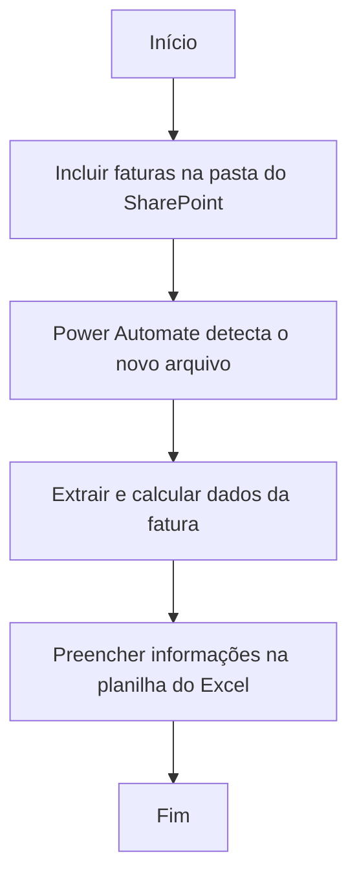

# Automação de leitura de fatura de energia elétrica - média tensão

O desafio em questão consiste em automatizar a leitura, a extração de informações e gerar uma base de dados das faturas de energia elétrica no modelo globalizado de média tensão que a SEJUSP recebe mensalmente.

<!-- more -->
## 1. Sobre o projeto
A SEJUSP conta com uma ampla rede de unidades administrativas espalhadas pelo território de Minas Gerais. Dentre os serviços contratados para operação destas unidades, está o fornecimento de energia elétrica. Atualmente, a CEMIG é a única concessionária a fornecer o serviço de média tensão para a SEJUSP no estado de Minas Gerais, resultando no envio de cobranças mensais (fatura).

A gestão dessas faturas é centralizada na Diretoria de Serviços Gerais (DSG), que coleta as informações de cada uma delas para sua gestão financeira, o que envolve os processos empenho, liquidação e pagamento destas. Considerando o volume de faturas mensais, este trabalho demanda bastante tempo e esforço da equipe responsável.

Diante dessa situação, criamos um fluxo automatizado utilizando a ferramenta de Automação Robótica de Processos - RPA[^1], _Power Automate Web_ com o suporte de Inteligência Artificial.

## 2. O que o robô faz
 - Realiza leitura da fatura de energia, identificando as informações que desejamos coletar;
 - Extrai informações solicitadas em formato pré definido; 
 - Insere informações e calcula os valores de CUSD, CCER, ENCARGOS, CONSUMO, IRPJ e outras variáveis.
 - Insere as informações e os cálculos em uma planilha estruturada.

## 3. Como funciona o robô
Por se tratar de um fluxo online, o robô já está programado para rodar automaticamente, sendo o gatilho para esta ação a inclusão de novas faturas na pasta do _Sharepoint_ designada para tal.

O robô de Média Tensão processa os documentos de forma inteligente e eficiente.

Veja o fluxo do robô:

## 4. Premissas

- O fluxo funciona para os modelos de fatura da concessionária Cemig em formato PDF que foram utilizados no treinamento da IA. Para diferentes modelos, é necessário novo treinamento e publicação da IA.
- As faturas precisam estar individualizadas, isto é, um arquivo equivale a uma única fatura. A DSG recebe as diversas faturas globalizadas em um único arquivo PDF. Assim, esse documento deve ser dividido, utilizando para tal serviços gratuitos disponíveis online[^2].
- As expressões de cálculo foram ajustadas para lidar com o formato numérico brasileiro (ponto de milhar e vírgula decimal) e valores nulos ou ausentes.

## 5. Utilização do robô
- O fluxo do _Power Automate Web_, foi compartilhado como Coproprietário para o servidor responsável por esse processo na DSG.
- Para usar o robô, mensalmente, devem ser inseridas faturas na pasta do _Sharepoint_ designada para tal. Cada fatura resultará em uma nova linha na planilha de controle.

## 6. Resultados

O processo manual era executado, em média, em 15 minutos para cada fatura, sendo 62 faturas por mês.
**Com o robô, agora, o processo para cada fatura é executado, em média, em 10 segundos!** :rocket:

[^1]:[Saiba mais sobre o que são ferramentas RPA.]()

[^2]:Dividir PDF online [opção 1](https://www.ilovepdf.com/pt/dividir_pdf); [opção 2](https://smallpdf.com/pt/dividir-pdf); [opção 3](https://tools.pdf24.org/pt/dividir-pdf).
