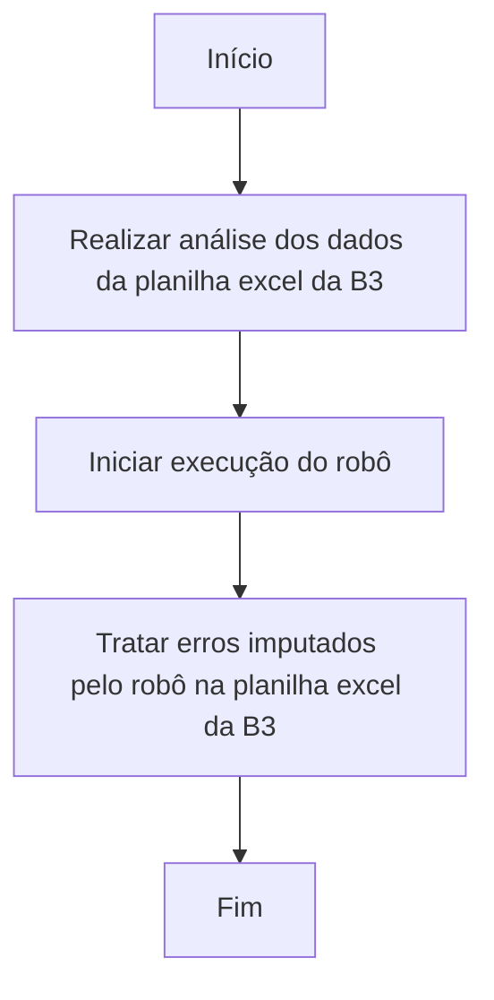

# Robô de desbloqueio de gravame

O desafio consiste em realizar o processo de desbloqueio do Gravame de todos os veículos solicitados a Coordenadoria Estadual de Trânsito- CET.

<!-- more -->
## 1. Sobre o projeto
A Diretoria de Gestão dos Credenciamentos de Veículos- DGCV recebe da Empresa B3 planilhas com solicitações de desbloqueio de gravames, que na prática é o cancelamento de reserva de financiamento de veículos, a ser tratado manualmente no Sistema do Departamento de Trânsito de Minas Gerais (SDAK).
A empresa B3 é a responsável junto a Coordenadoria Estadual de Trânsito- CET pela inserção, alteração e baixa de gravames financeiros em veículos emplacados em Minas Gerais. Os dados dos veículos, que por algum motivo, não foram processados na empresa B3, são encaminhados para a CET para que inserção no SDAK e correção de erros
As planilhas são enviadas, diariamente pela Empresa B3, com informações de dezenas de veículos, para desbloqueio de gravames e demais tratativas referentes a pendências de gravames financeiros de veículos. 

## 2. O que o robô faz
- Extrai dados referentes aos veículos a serem desbloqueados da planilha enviada pela B3;
- Insere dados como número de chassi, CPF/CNPJ, data de desbloqueio no sistema SDAK;
- Realiza a validação dos dados enviados como número de caracteres de CPF/CNPJ;
- Executa o desbloqueio do gravame com o respectivo motivo de desbloqueio;
- Retorna o status de cada solicitação para a planilha enviada pela B3;
- Informa a finalização do fluxo e execução de todas as solicitações ao operador.

## 3. Como funciona o robô
O operador realiza a execução do robô através do Power Automate Desktop, instalado na máquina.

Veja o fluxo do robô:

## 4. Premissas

- Ajustar a formatação todos os campos numéricos para serem reconhecidos como texto e não número, tendo em vista a necessidade de compilar os “0” a esquerda do CPF;

- Ajustar os caracteres para que os dados de CPF tenham exatamente 11 caracteres e os de CNPJ tenham 14 caracteres;

- Realizar ajustes nos dados referentes à placa e Renavam, evitando duplicidades e divergências entre as linhas;

- SDAK precisa estar conectado para execução do robô;

## 5. Utilização do robô

- Neste projeto, a construção do robô foi realizada externamente, utilizando como base de dados as planilhas enviadas pela B3;
- Os erros considerados para tratamento durante a execução do robô foram repassados pelos servidores da CET;
- É necessária a conferência da base de dados para plena execução do robô, bem como estabilidade do sistema SDAK.

## 6. Resultados

O processo manual era executado, em média, em 20 minutos para cada planilha, sendo 01 planilha por dia. 
**Com o robô, agora, o processo para cada planilha é executado, em média, em 9 minutos! Ou seja, o processo está 444% mais rápido do que antes.** :rocket:
